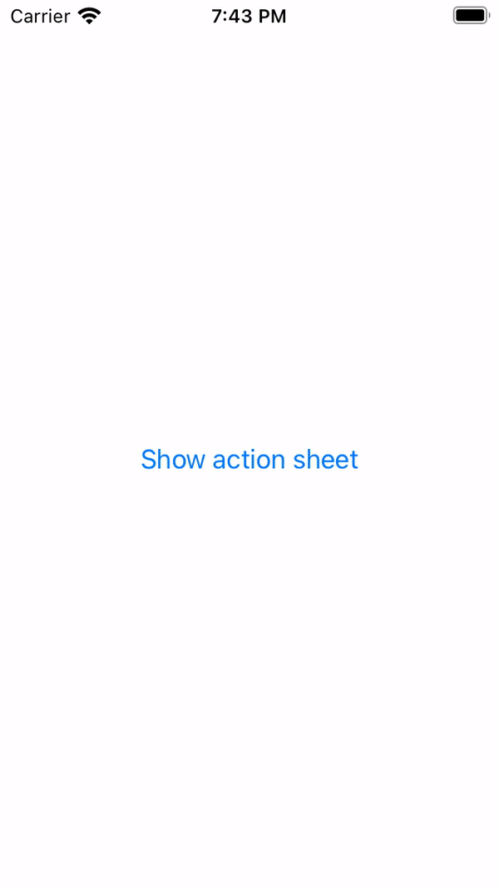

# SwiftUI Action Sheet Example

An example of how to build a reusable action sheet in SwiftUI.



## Usage

It's as simple as calling `.actionSheet` on any SwiftUI `View`.

It's very similar to using `.fullscreenCover` or `.sheet` if you've used those before.

```swift
struct ContentView: View {
    
    // MARK: - Properties
    
    @State private var isPresented: Bool = false
    
    // MARK: - Content
    
    private var button: some View {
        Button(
            action: {
                isPresented = true
            },
            label: {
                Text("Show action sheet").padding()
            }
        )
    }
    
    var body: some View {
        button
            .actionSheet(isPresented: $isPresented) { // Call `.actionSheet`
                VStack {
                    Text("I'm an action sheet")
                        .padding()
                    Image(systemName: "questionmark")
                        .fixedSize()
                        .frame(height: 100)
                    Button("Dismiss") {
                        isPresented = false
                    }
                    .padding(48.0)
                }
            }
    }
}
```

## How does it work?

Check `ActionSheet.swift` for the source code, although here is a brief rundown of the core ideas below:

### 1. First, we use a `ViewModifier` to be able to wrap Views

The `.actionSheet` function that you can call on any SwiftUI `View` is built using a `ViewModifier`.

It is defined like so:

```swift
extension View {
    // Define the action sheet function that can be called on any `View`
    func actionSheet(...) -> some View {
        modifier(ActionSheetModifier(...)
    }
}

struct ActionSheetModifier: ViewModifier {    
    // Our actual view modifier
    // The `content` argument is the `View` that the `actionSheet` function is being called on
    // We can manipulate the `View` / `content` however we want!
    func body(content: Content) -> some View {
        content
    }
}
```

At a high-level, our `ViewModifier` essentially wraps the `content` in a `ZStack` with our `ActionSheet`:

```swift
struct ActionSheetModifier: ViewModifier {

    @Binding var actionSheetIsPresented: Bool

    func body(content: Content) -> some View {
        ZStack {
            content
            if actionSheetIsPresented {
                ActionSheet()
            } else {
                EmptyView()
            }
        }
    }
}
```

The code above is simplified, but as you can see, `ViewModifiers` are super powerful because we can wrap/encapsulate any view with another, simply by calling a function on a `View`.


### 2. The second idea, is we allow our view modifier to take a `@ViewBuilder`

Without getting into the weeds of it, the `@ViewBuilder` decorator allows our functions to take SwiftUI closures that return `some View` as an argument.

For example, if you see the `actionSheet` function below, there is a closure where you can build a SwiftUI `View`, which will be used to populate the Action Sheet.

```swift
.actionSheet(isPresented: $isPresented) {
    VStack {
        Text("I'm an action sheet!")
    }
}
```

This is a super cool feature of SwiftUI.

The **trick** to working with `@ViewBuilder` I've found, **is to use Generics**. In otherwords, when writing your functions and classes that use `@ViewBuilder`, add a generic constraint: `<V: View>`:

```swift
// 1. We return a generic `View`, `V` in our `@ViewBuilder` closure
func actionSheet<V: View>(isPresented: Binding<Bool>, @ViewBuilder content: () -> V)

// 2. We use a generic `View`, `V` in our `ViewModifier` struct
struct ActionSheetModifier<V: View>: ViewModifier {

    @ViewBuilder var actionSheetContent: V
    
    func body(content: Content) -> some View {
        // ...
        ActionSheet {
            actionSheetContent
        }
    }    
}

// 3. The ActionSheet SwiftUI `View` itself has a generic constraint too that allows us to use `@ViewBuilder` to take a SwiftUI `View` as an input argument.
struct ActionSheet<Content: View>: View {

    // ...

    @ViewBuilder let content: Content

    // ...
}
```

### 3. Using `DragGesture()` and `Binding`

The last idea here, is that we used `DragGesture()` to handle panning the Action Sheet vertically. 

Using `@Binding` also provided us with a bi-directional data flow, allowing our Action Sheet struct to dismiss itself and set `isPresented = false`, and also allow the `View` that calls the `.actionSheet` function to toggle `isPresented` as well.

There are many great tutorials on gestures and bindings in Swift, so I'd recommend checking those out for more clarification.

## Conclusion

I hope this example helps! Feel free to check out my website at https://www.josharnold.me.

